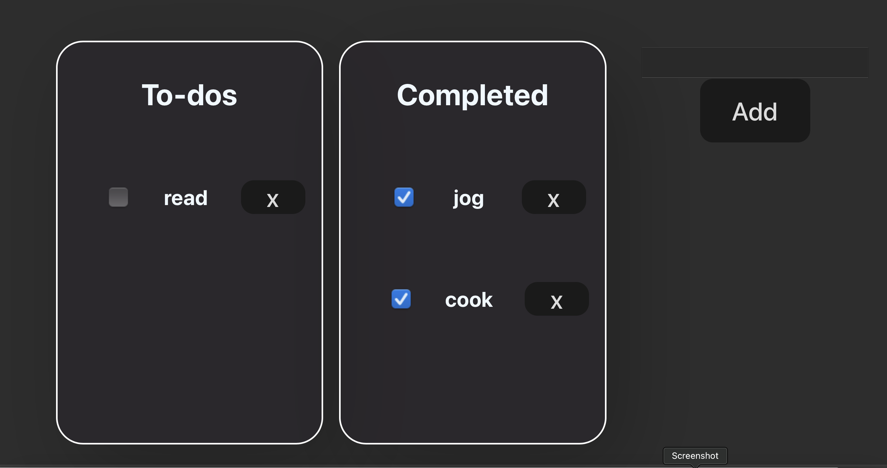

# Exercise Todo App

This is a super simple Todo App to practice these react concepts:

- Components
- Props & States
- Conditional Rendering
- Composition & Specialisation

---

### TodoList.jsx

The TodoList Component is the parent component for the other made component: TodoItem & TodoForm

I use conditional rendering to render based on the some of the states like if the todoList state (which is a list of objects) is not empty it should render the TodoItem component, else it render h5 tag with the text 'no todos'. Another instances are for conditional rendering completed todos and also the do form which is triggered by an event.

I use props to send the states to child component TodoItem. I also send event handler function as props to the children components, so when there is an event occuring inside the children components that needs to change the states in the parent components could be handled.

### TodoItem.jsx

A component that renders each todo with a checkbox to mark the compelition of a task and button to delete the tasks. These events are handled by function that are sent as props from the parent

### TodoForm.jsx

A component that renders a form for the user to add new todos. The even is by handler by a function parent compontent

##### Screenshot

